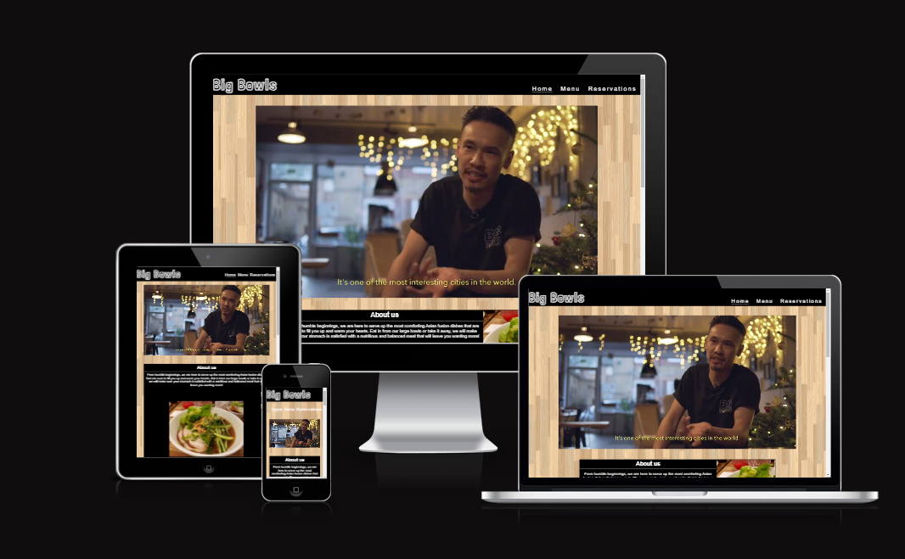
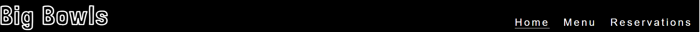
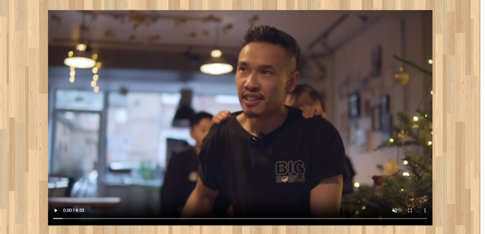
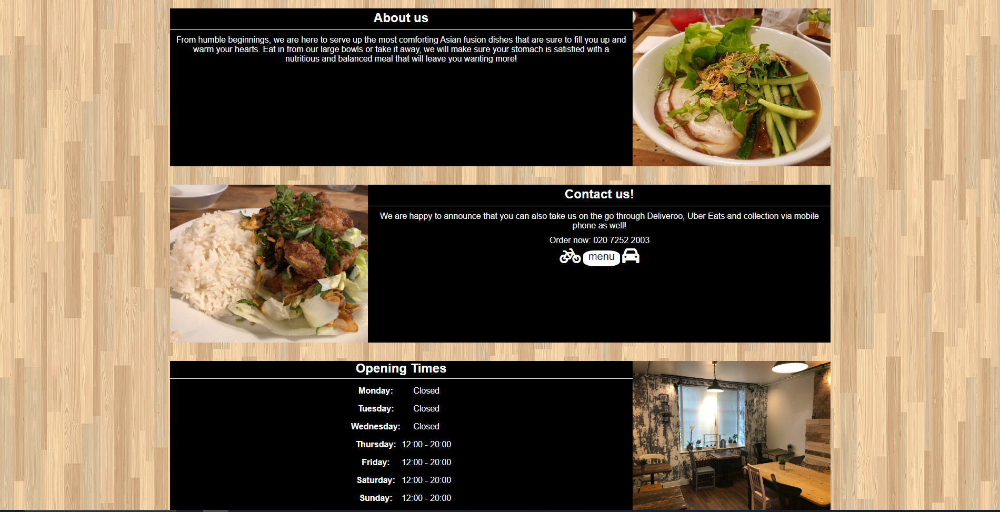
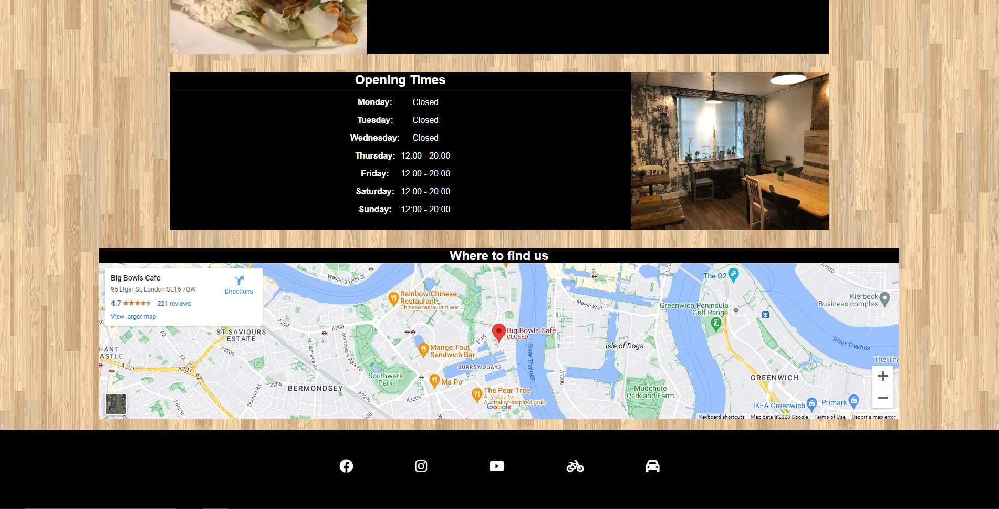
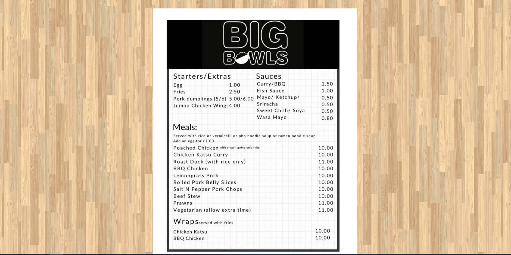
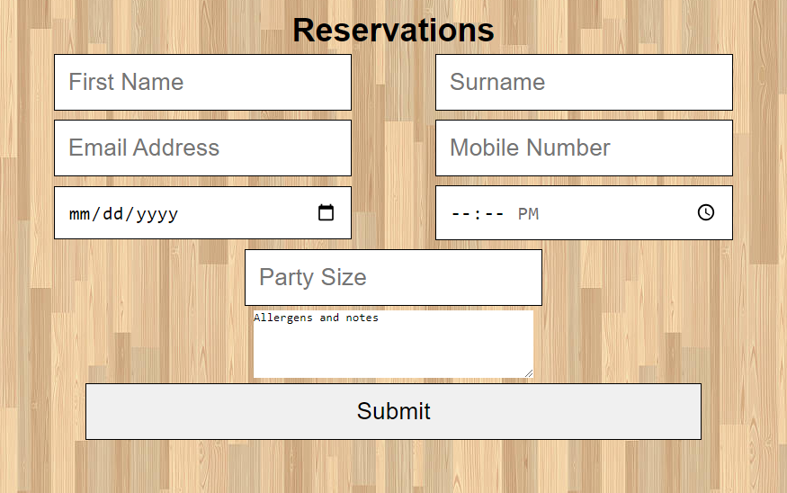
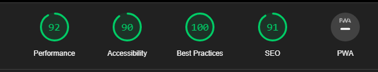

# **Big Bowls**

The Big Bowls website is an information and utility source for potential customers to quickly gather essential information about the restaurant in an efficient manner.
Users of this website will be able to find out all the information they need about the restaurant from the opening times, to the location, the menu and even be able to book a table for dining later.

## Features

- navigation header

* At the top of the page there is a navigation bar that shows the logo (that also links to the home page) and three navigation buttons that allows the user to quickly access the Home Page, the Menu page and a reservations page.
* The logo and the navigation buttons are split up on either side of the screen for clarity and space.

* The header bar is in black which is greatly contrasted by the white text from the navigation buttons and the logo. The logo is in a fun font that resembles the cathode light fixture that is at the front of the restaurant.

* Navigation is clear and concise and allows the user to know where they are and what they are looking at.

- Featured video

- An interactable video that can be played/paused with volume controls that gives insight the journey of the chef/owner of the restaurant.

- Creates a more intimate relationship with the user who will feel more attatched to the people behind the restaurant as they understand more about their story and how they got to this point.

- There was a deliberate choice in background which has the effect of wood panels that match the interior design of the restaurant itself.

- Seperated sections are more pleasing to the eye and allows user to digest information at their own pace with pictures to showcase the food they could purchase.

- Usable links within the contact us section gives useful information to the user and allows quick access to more information that they may want at the time after learning about the services provided. Bike icon is anchored to the deliveroo site whilst the car has been anchored to the uber site where users would be able to order.

- table used to display opening times in a neat and ordrely manner makes retaining information easier.

- embedded google maps that is interactable and can be dragged to find out locations. Easy to use and a visual clue as to where the restaurant is. Address is in the top left corner of the map as well.

- Footer contains links to social media and delivery sites that are useful to the end user who may want to subscribe to these pages to find out the latest information such as sudden closures or new items. Consistent footer that is on every page means that it is easily accessible through every page.

- Menu is listed in images down a webpage to be scrolled through. large enough to be read and isnt crammed as to look like there is too much information being taken at once.

- Reservations form is validated so all boxes must be filled other than the allergens and notes boxes. Boxes need to be filled in a correct manner otherwise a pop-up will refuse submission.

- ## Testing

- I have tested the page through the browsers: Chrome, Safari, Microsoft Edge.

- I have confirmed the project is responsive and functions on all standard screen sizes using the chrome developer tool functions and looks good in those screen sizes.

- I have checked the all the navigation links, anchors, videos and responsive elements work in the intended way and they are clear and easy to understand. Navigating the website is simple.

- I have confirmed that entries into the form will only accept the validated items and will not allow other entries in.

- ## Bugs

- solved bugs:
- When deploying to Github the webpage did not load into the index file straight away as the file name was wrong and was hidden within other folders. I sorted this issue out by bringing the file out into the root directory and changed all link paths to match.

- unsolved bug:
- submitting the form brings about an error as there is no file dump for the information to be posted to.

- ## Validator Testing

- HTML - No errors returned through the official W3C validator.

- CSS - No errors returned through the official Jigsaw validator.

- Accessibility - I conformed that the fonts are easy to read and there is good accessibility through the lighthouse devtool.

- ## Deployment

- The site has been deployed to GitHub pages and were done so by the following:

  - Click on settings within the GitHub Project page.
  - Click on "Pages" in the left panel.
  - Select the master branch (main) and select the /(root) folder.
  - Save and Launch the website.

- The live link to the website can be found on this link - [Big Bowls](https://jteo99.github.io/First_Project/).

- ## Credits

### Content

- Inspiration for the navigation links had been taken from the CI [Love Running](https://learn.codeinstitute.net/courses/course-v1:CodeInstitute+LR101+2021_T1/courseware/4a07c57382724cfda5834497317f24d5/637be1a2e3b84b25aa33f3ab4d98603c/?child=first) project.

- Formatting for the README.md file was taken from the [Coding Club](https://learn.codeinstitute.net/courses/course-v1:CodeInstitute+CSSE_PAGPPF+2021_Q2/courseware/66cf361c769a41d496f5001fae6f9be7/3b5cd5dc8313462aa5975a3c9b9a1a3c/) example.

### media

- The images had been found on the [Trip Advisor](https://www.tripadvisor.co.uk/Restaurant_Review-g186338-d15011394-Reviews-Big_Bowls-London_England.html) page for the restaurant.

- The video was taken from the [Big Bowls Youtube Page](https://www.youtube.com/@bigbowls3078).
